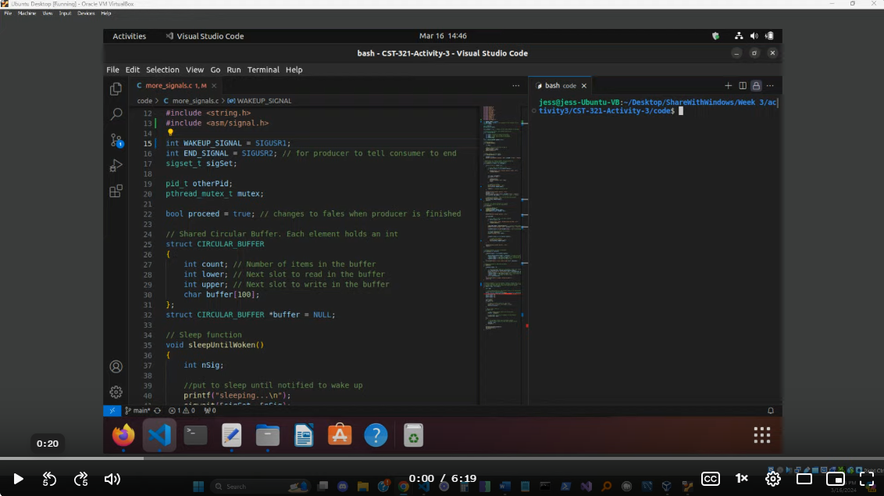
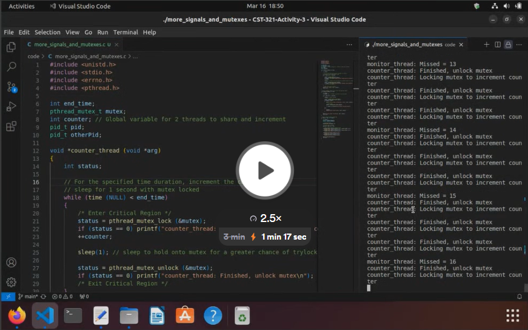

# CST-321-Activity-3

## More Signals
This code in the [more_signals program](./code/more_signals.c) implements a producer-consumer scenario using shared memory and signals for synchronization.

Signals:
- Two custom signals are defined: WAKEUP_SIGNAL (SIGUSR1) and END_SIGNAL (SIGUSR2).
- Signal handling functions are implemented for these signals.

Circular Buffer:
- A shared circular buffer structure CIRCULAR_BUFFER.
- It contains fields for count, lower index, upper index, and a buffer array to hold data.
- Functions putValue and getValue manipulate the buffer for adding and retrieving data.
- The buffer is shared between the producer and consumer processes using shared memory (mmap).

Producer Function (producer):
- Takes command-line arguments as input.
- Produces characters from the input arguments and adds them to the circular buffer.
- Signals the consumer to wake up after adding data to the buffer.
- Terminates when all input arguments are processed and sends an END_SIGNAL to the consumer.

Consumer Function (consumer):
- Sets up signal handling for WAKEUP_SIGNAL.
- Consumes characters from the circular buffer and prints them.
- Signals the producer to wake up if the buffer is full.
- Terminates when signaled by the producer (proceed becomes false).

Main Function:
- Creates shared memory for the circular buffer.
- Forks a child process for the producer and runs the consumer logic in the parent process.
- Passes command-line arguments to the producer.

This setup ensures synchronization between the producer and consumer processes using signals and a shared circular buffer for inter-process communication.

Video:

## More Signals and Mutexes
This [more_signals_and_mutexes](./code/more_signals_and_mutexes.c) program demonstrates the use of mutex locks and the pthread_mutex_trylock() function to control access to a shared variable between two threads.

Features:
Two Threads:

counter_thread: Increments a shared counter within a critical section protected by a mutex lock.
monitor_thread: Attempts to read the shared counter using pthread_mutex_trylock() every 3 seconds.
Mutex Locking:

The pthread_mutex_lock() function is used to acquire the mutex lock before incrementing the counter in the counter_thread.
The pthread_mutex_trylock() function is used in the monitor_thread to attempt to acquire the lock without blocking.
Resource Access Control:

Both threads share the same mutex to control access to the shared counter variable.
Video:

